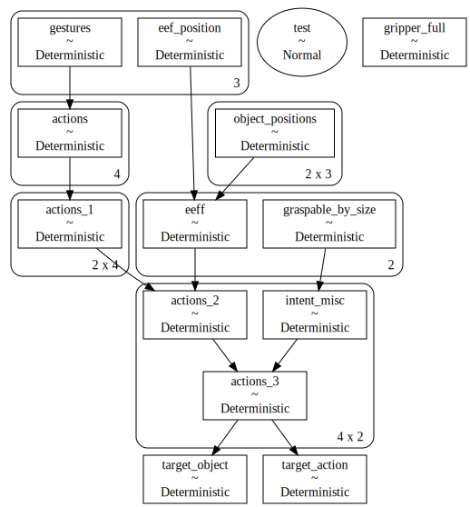
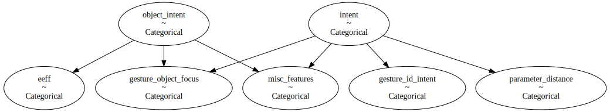

# Intent Estimation via Gestures

## Install
Either install with conda:
```
conda install -c conda-forge pymc3 numpy matplotlib pandas pygraphviz
```
or pip:
```
pip install pymc3 numpy matplotlib pandas graphviz
```

## Usage

Get familiar with PyMC3 nodes:
```
jupyter notebook bayes_net_tutorial_nb.ipynb
```
Try Deterministic model:
```
python model_no1.py
```
Visualized graph of Deterministic model:


Try CPD model:
```
python model_no2.py
```

